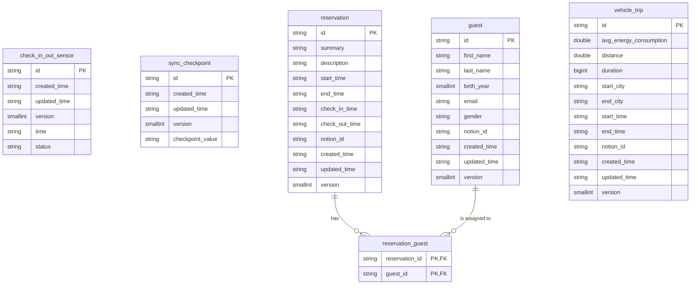

## Database schema

### Table Descriptions

| Table                   | Description                                                                                                      | Type of data  |
|:------------------------|:-----------------------------------------------------------------------------------------------------------------|:--------------|
| **check_in_out_sensor** | Stores sensor data for check-in and check-out events, including timestamps and status.                           | raw           |
| **guest**               | Stores unique guest profiles, including name, contact details, and external identifiers.                         | raw           |
| **reservation**         | Stores cabin reservations, including planned start/end times and calculated actual check-in and check-out times. | raw + derived |
| **reservation_guest**   | Links reservations with guests in a many-to-many relationship.                                                   | derived       |
| **sync_checkpoint**     | Stores the last synchronization checkpoints for various data sources.                                            | raw           |
| **vehicle_trip**        | Stores details for all vehicle trips, including consumption, distance, duration, locations, and timestamps.      | raw           |

