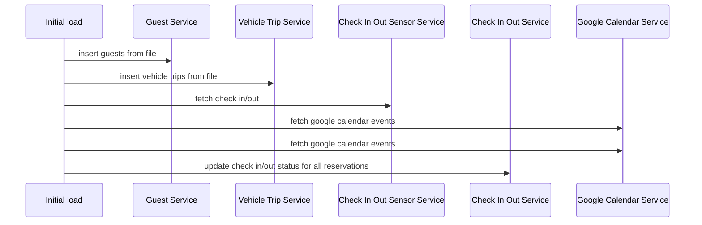
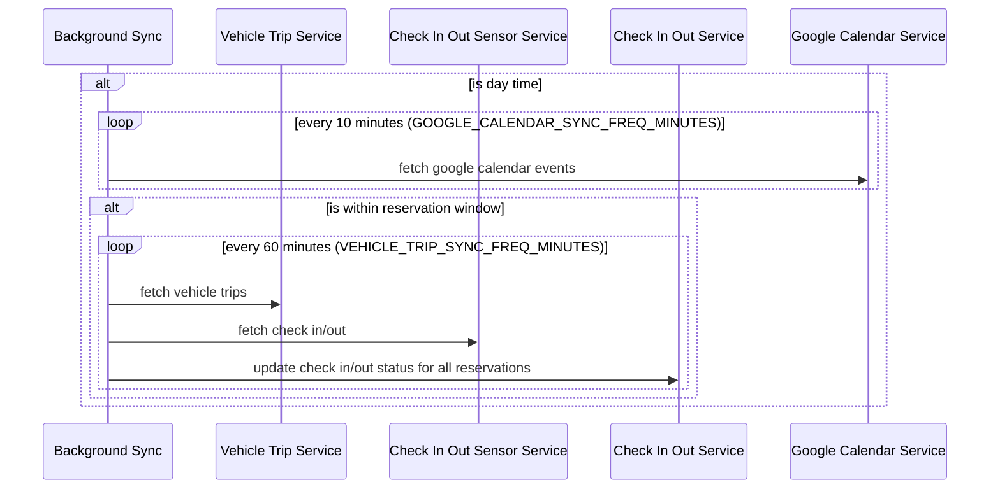

## Initial load (at startup)

## Background sync (continuously)

### Rules

#### Is day time?

`DAYTIME_START (default to 08:00) <= now <= DAYTIME_END (default to 23:00)`

#### Is within reservation window?

`reservation.startTime - 1 day <= now <= reservation.endTime + 1 day`
