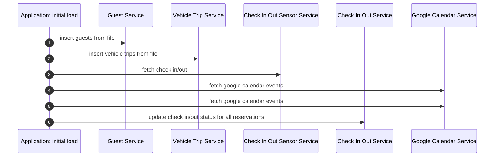
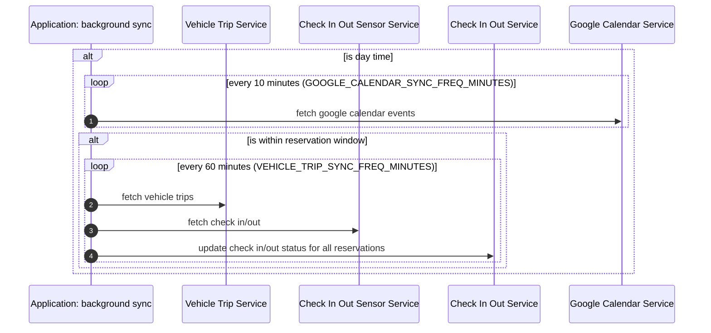
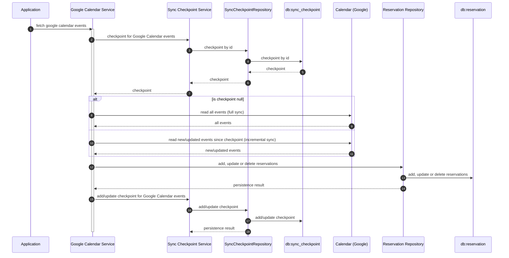
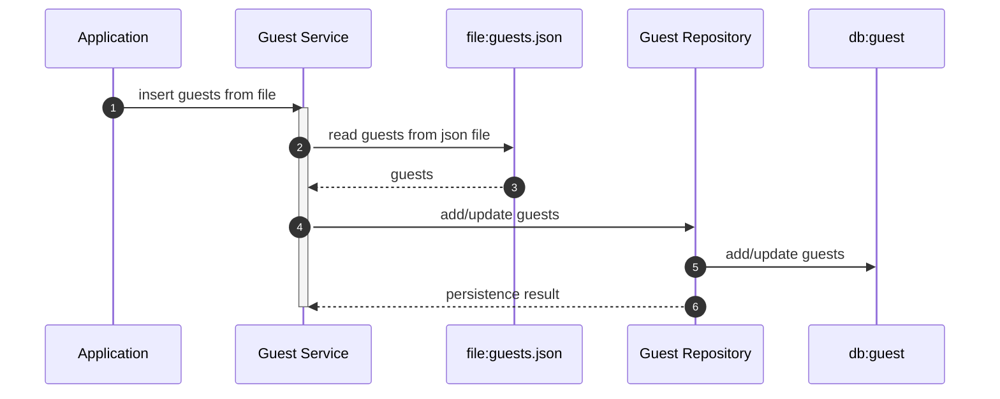
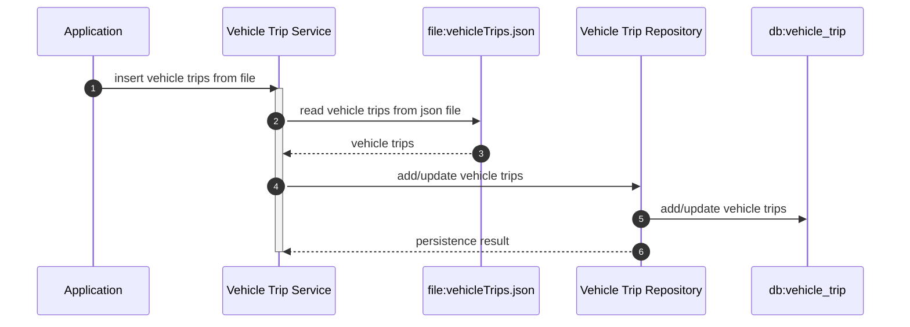
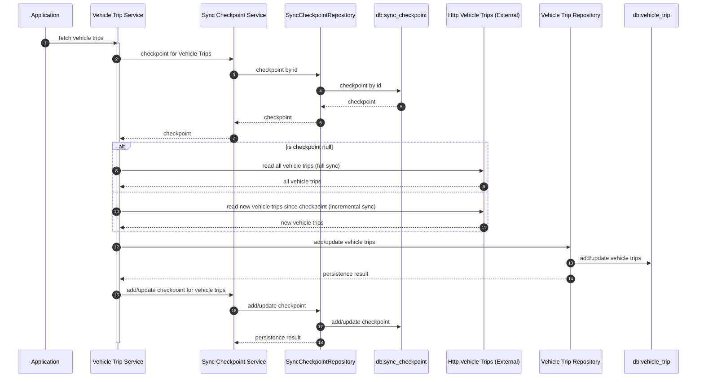

## Initial load (at startup)

The initial load is executed on every application startup, regardless of whether it has already run before. This ensures
the database is always updated with the latest content from static files (such as guests, vehicle trips, and
summary-to-guest ID mappings). With this approach, you can change the static files and restart the application to
apply updates.

## Background sync (continuously)

The background sync task automatically keeps application data in sync with external sources. It launches scheduled tasks
as background coroutines that:

- Regularly fetch and update reservations from Google Calendar during designated daytime hours.
- Periodically synchronize vehicle trips and check-in/out sensor data, but only within both daytime and active
  reservation windows, to minimize unnecessary operations.
- Continuously update the check-in/out status for all reservations based on the latest data.

Each sync task operates at its own configurable interval, and all background tasks are automatically stopped when the
application is shut down to ensure a clean exit.

### Rules

#### Is day time?

`DAYTIME_START (default to 08:00) <= now <= DAYTIME_END (default to 23:00)`

#### Is within reservation window?

`reservation.startTime - 1 day <= now <= reservation.endTime + 1 day`

## Google Calendar Service

The Google Calendar Service automates the synchronization of booking reservations by periodically retrieving events from
a designated Google Calendar. It supports both full and incremental synchronization by leveraging sync tokens, ensuring
that only new or changed events are fetched after the initial sync.

Key responsibilities include:

- Fetching events from Google Calendar using either a complete pull or updates based on the last sync state.
- Storing new events as reservations, updating existing ones if changes are detected, and removing reservations if
  events are deleted or canceled in the calendar.
- Handling paginated event data and ensuring changes are persistently stored.
- Maintaining sync checkpoints to enable efficient incremental updates and resilience in the face of errors such as
  invalid sync tokens.

This service ensures that the application's reservation database always reflects the current state of the linked Google
Calendar, providing a robust and up-to-date booking management workflow.

## Guest Service

The GuestService is responsible for managing guest information within the application. It reads guest data from a
designated JSON file, then processes and updates the internal guest database accordingly. As it processes the guests, it
ensures that new guests are added, existing guests are updated if their details have changed, and unchanged records are
left as-is.

## Vehicle Trip Service

The VehicleTripService manages the synchronization and storage of vehicle trip data within the application. It provides
two main functions:

1. `insertVehicleTripsFromFile`:
   This function reads vehicle trip data from a specified JSON file, then updates the local database by adding new
   trips, updating changed trips, or skipping unchanged ones.
2. `fetchVehicleTrips`:
   This function connects to an external vehicle trip service. After authenticating, it fetches trip data (using either
   a full or incremental sync based on a saved checkpoint), processes all available pages, and updates the local
   database. It then saves the latest sync date for future use and logs statistics about added, updated, or unchanged
   trips.

Through these methods, VehicleTripService ensures that local records remain consistent with both offline files and
external sources, enabling reliable and up-to-date vehicle trip management.

### insert vehicle trips from file

### fetch vehicle trips

## Check In/Out Sensor Service

## Check In/Out Service
