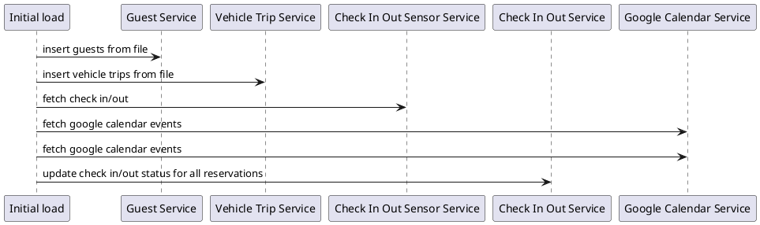
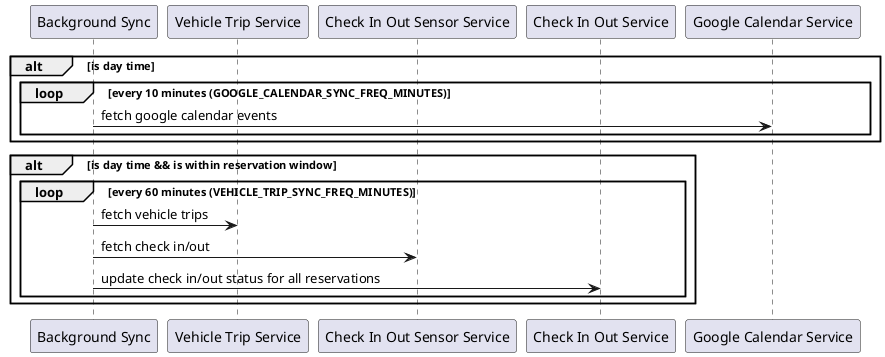

## Initial load (at startup)

```plantuml
@startuml

participant "Initial load"                  as InitialLoad
participant "Guest Service"                 as GuestService
participant "Vehicle Trip Service"          as VehicleTripService
participant "Check In Out Sensor Service"   as CheckInOutSensorService
participant "Check In Out Service"          as CheckInOutService
participant "Google Calendar Service"       as GoogleCalendarService

InitialLoad -> GuestService                 :insert guests from file
InitialLoad -> VehicleTripService           :insert vehicle trips from file
InitialLoad -> CheckInOutSensorService      :fetch check in/out
InitialLoad -> GoogleCalendarService        :fetch google calendar events
InitialLoad -> GoogleCalendarService        :fetch google calendar events
InitialLoad -> CheckInOutService            :update check in/out status for all reservations

@enduml
```

## Background sync (continuously)

```plantuml
@startuml

participant "Background Sync"                       as BackgroundSync
participant "Vehicle Trip Service"                  as VehicleTripService
participant "Check In Out Sensor Service"           as CheckInOutSensorService
participant "Check In Out Service"                  as CheckInOutService
participant "Google Calendar Service"               as GoogleCalendarService

alt is day time
    loop every 10 minutes (GOOGLE_CALENDAR_SYNC_FREQ_MINUTES)
        BackgroundSync -> GoogleCalendarService     :fetch google calendar events
    end
end

alt is day time && is within reservation window
    loop every 60 minutes (VEHICLE_TRIP_SYNC_FREQ_MINUTES)
        BackgroundSync -> VehicleTripService        :fetch vehicle trips
        BackgroundSync -> CheckInOutSensorService   :fetch check in/out
        BackgroundSync -> CheckInOutService         :update check in/out status for all reservations
    end
end

@enduml
```

### Rules
- is day time: now is between 0(.00)
