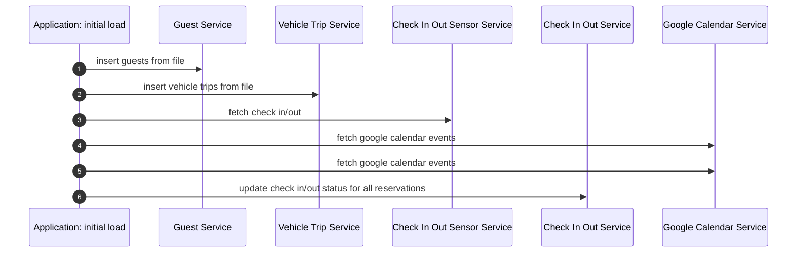
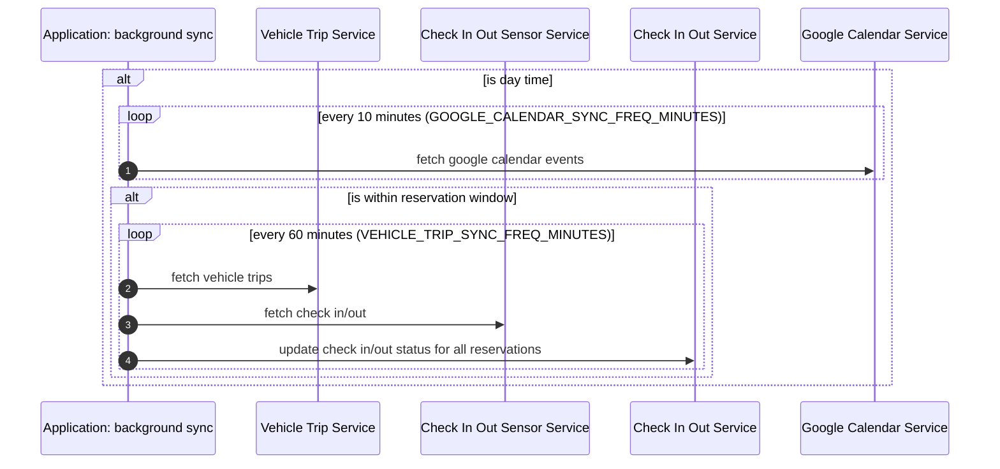
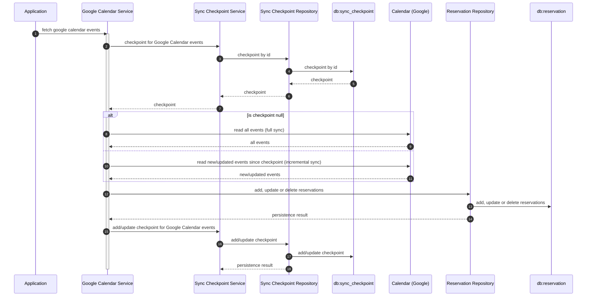
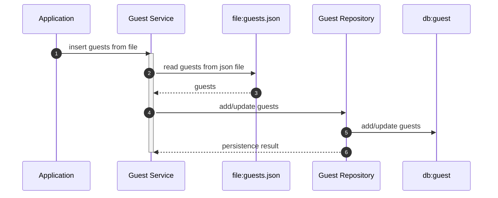
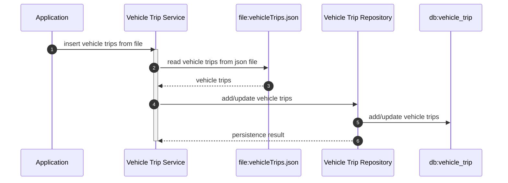
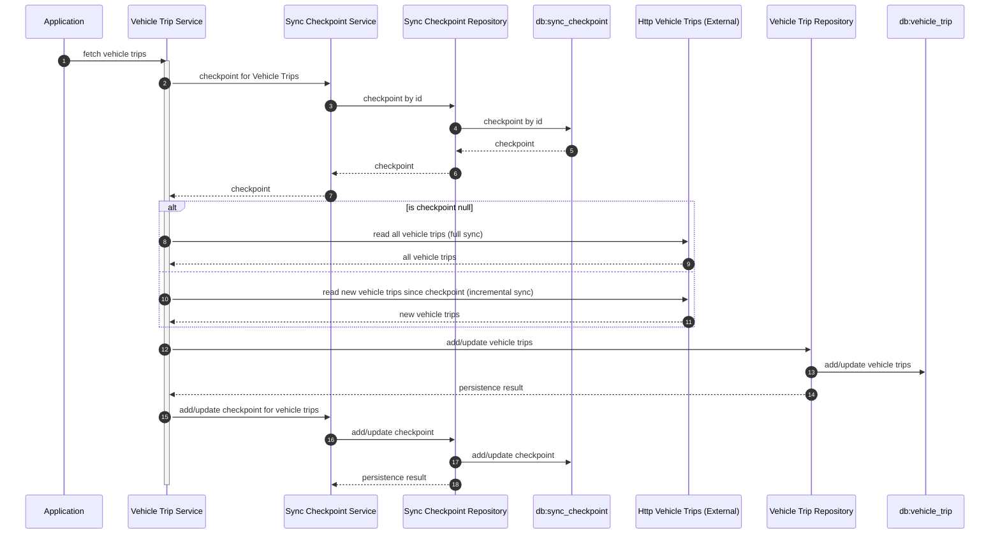
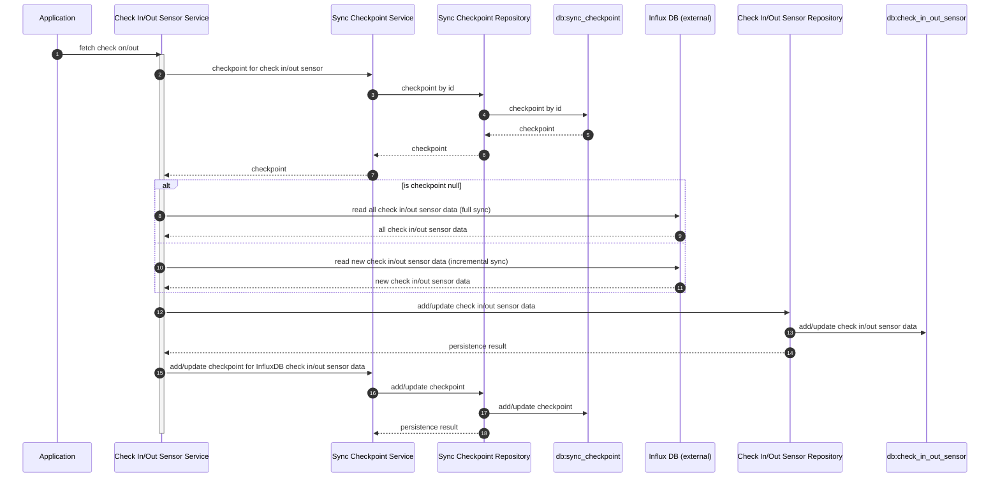
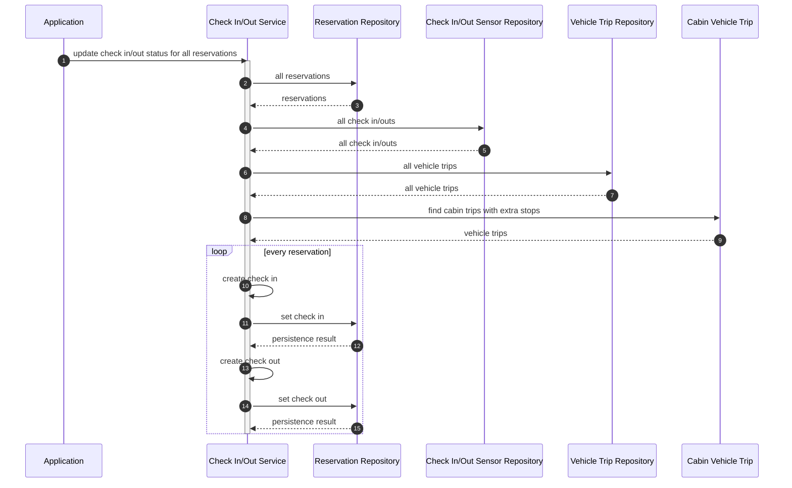

## Initial load (at startup)

The initial load is executed on every application startup, regardless of whether it has already run before. This ensures
the database is always updated with the latest content from static files (such as guests, vehicle trips, and
summary-to-guest ID mappings). With this approach, you can change the static files and restart the application to
apply updates.

## Background sync (continuously)

The background sync task automatically keeps application data in sync with external sources. It launches scheduled tasks
as background coroutines that:

- Regularly fetch and update reservations from Google Calendar during designated daytime hours.
- Periodically synchronize vehicle trips and check-in/out sensor data, but only within both daytime and active
  reservation windows, to minimize unnecessary operations.
- Continuously update the check-in/out status for all reservations based on the latest data.

Each sync task operates at its own configurable interval, and all background tasks are automatically stopped when the
application is shut down to ensure a clean exit.

### Rules

#### Is day time?

`DAYTIME_START (default to 08:00) <= now <= DAYTIME_END (default to 23:00)`

#### Is within reservation window?

`reservation.startTime - 1 day <= now <= reservation.endTime + 1 day`

## Google Calendar Service

The `GoogleCalendarService` automates the synchronization of booking reservations by periodically retrieving events from
a designated Google Calendar. It supports both full and incremental synchronization by leveraging sync tokens, ensuring
that only new or changed events are fetched after the initial sync.

Key responsibilities include:

- Fetching events from Google Calendar using either a complete pull or updates based on the last sync state.
- Storing new events as reservations, updating existing ones if changes are detected, and removing reservations if
  events are deleted or canceled in the calendar.
- Handling paginated event data and ensuring changes are persistently stored.
- Maintaining sync checkpoints to enable efficient incremental updates and resilience in the face of errors such as
  invalid sync tokens.

This service ensures that the application's reservation database always reflects the current state of the linked Google
Calendar, providing a robust and up-to-date booking management workflow.

## Guest Service

The `GuestService` is responsible for managing guest information within the application. It reads guest data from a
designated JSON file, then processes and updates the internal guest database accordingly. As it processes the guests, it
ensures that new guests are added, existing guests are updated if their details have changed, and unchanged records are
left as-is.

## Vehicle Trip Service

The `VehicleTripService` manages the synchronization and storage of vehicle trip data within the application. It
provides
two main functions:

1. `insertVehicleTripsFromFile`:
   This function reads vehicle trip data from a specified JSON file, then updates the local database by adding new
   trips, updating changed trips, or skipping unchanged ones.
2. `fetchVehicleTrips`:
   This function connects to an external vehicle trip service. After authenticating, it fetches trip data (using either
   a full or incremental sync based on a saved checkpoint), processes all available pages, and updates the local
   database. It then saves the latest sync date for future use and logs statistics about added, updated, or unchanged
   trips.

Through these methods, VehicleTripService ensures that local records remain consistent with both offline files and
external sources, enabling reliable and up-to-date vehicle trip management.

### insert vehicle trips from file

### fetch vehicle trips

## Check In/Out Sensor Service

The `CheckInOutSensorService` manages the retrieval and storage of check-in and check-out sensor data, primarily for
tracking occupancy and usage over time. It connects to an InfluxDB time-series database, running queries within specific
time ranges to fetch sensor state changes (such as "checked in" or "checked out").
The service supports both full and incremental synchronization based on a checkpoint system, ensuring only new or
unprocessed sensor records are fetched and persisted. After fetching the data, it adds or updates records in the
internal database and updates the checkpoint to the newest processed event, maintaining efficient and accurate
synchronization with the external sensor data source.

## Check In/Out Service

The `CheckInOutService` orchestrates the detection and recording of guests’ check-in and check-out times for cabin
reservations. It integrates data from reservations, check in/out sensor data, and vehicle trips to determine the most
accurate check-in and check-out events for each reservation.

The function `updateCheckInOutStatusForAllReservations` updates the check-in and check-out status for all reservations
by:

- Fetching all existing reservations, check in/out sensor data (by date), and relevant vehicle trips.
- For each reservation, attempt to determine check-in and check-out times through the following data sources (in
  priority order):
    1. vehicle trip
    2. check in/out sensor data, and
    3. reservation calendar times
- Persisting any new or updated check-in/out details with the reservation record.

By systematically synthesizing information from multiple sources, the service aims to ensure reservation records have
the most accurate and up-to-date check-in and check-out statuses possible.

### Rules

#### Check-In Time Determination Logic

When automatically determining the check-in time for a reservation, the system follows a priority order based on
available data sources:

1. **Vehicle Trip Data**:
   If there is a vehicle trip record that likely represents the guest's arrival at the cabin, and the trip's end time is
   available, this time is used as the check-in time. The source is recorded as "Vehicle Trip".
2. **Check-In Sensor Data**:
   If no suitable vehicle trip is found, but there is a check-in sensor event matching the reservation
   and providing a check-in timestamp, this is used as the check-in time. The source is recorded as "Check-In Sensor".
3. **Reservation Start Time**:
   If neither a relevant vehicle trip nor a sensor event is available, the check-in time defaults to the reservation's
   scheduled start time. The source is indicated as "Calendar Event".

This order ensures that the system uses the **most precise and reliable check-in information available**, falling back
on the calendar when primary sources are missing.

### Check-Out Time Determination Logic

When automatically determining the check-out time for a reservation, the system follows a prioritized set of rules to
choose the most accurate and relevant timestamp:

1. **Vehicle Trip Data**:
   If there is a vehicle trip that likely corresponds to the guest's departure from the cabin, and the trip's start time
   is available, this time is used as the check-out time. The source is labeled as "Vehicle Trip".
2. **Check-Out Sensor Data**:
   If no suitable vehicle trip is found, but a check-out sensor event provides a check-out time for the
   reservation, this timestamp is selected as the check-out time. The source is labeled as "Check-Our Sensor".
3. **Reservation End Time**:
   If neither a relevant vehicle trip nor a matching sensor event is available, the system defaults to using the
   reservation's scheduled end time as the check-out time. The source is indicated as "Calendar Event".

This logic ensures that the system always records the check-out time using the **best available evidence**, giving
priority to real-world events and falling back on the original reservation details when necessary.
